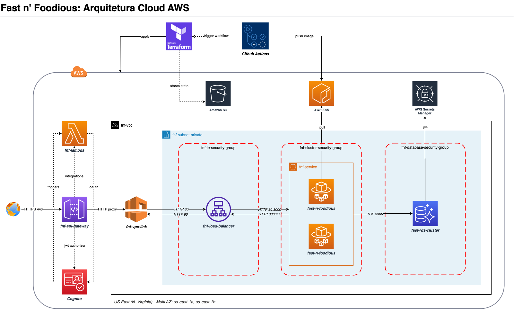
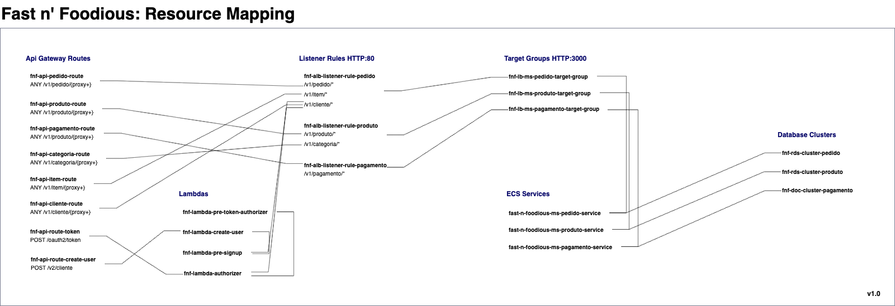
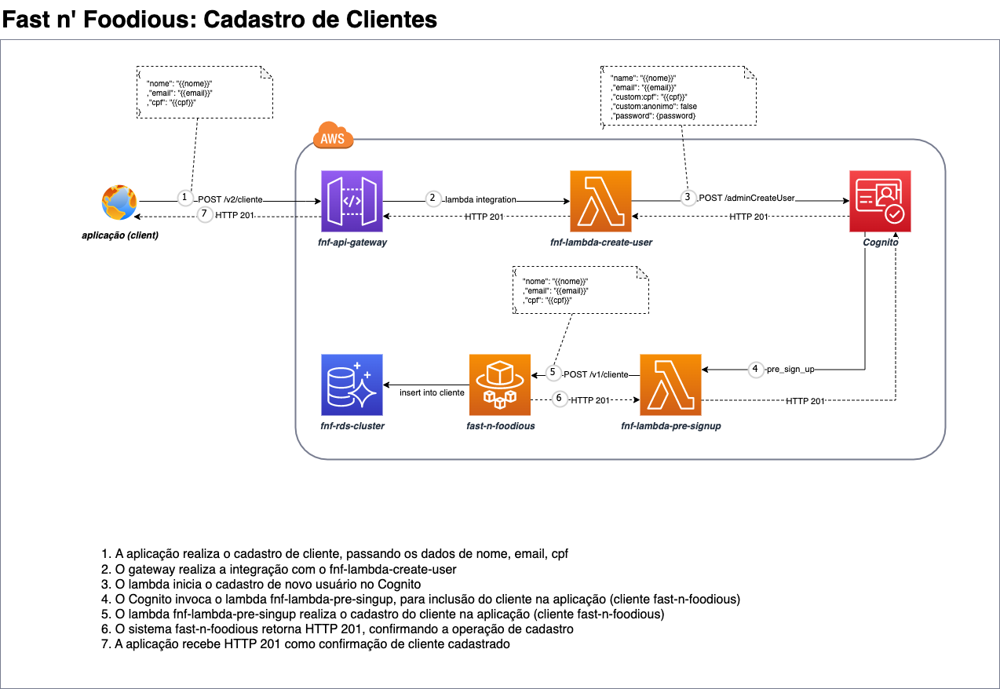
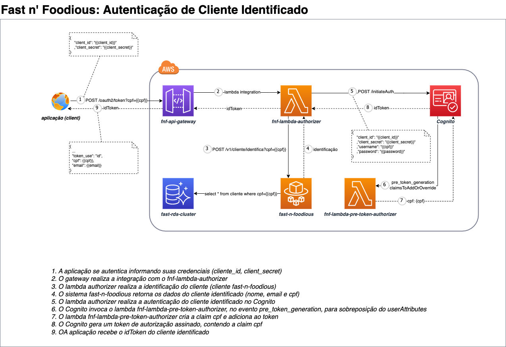
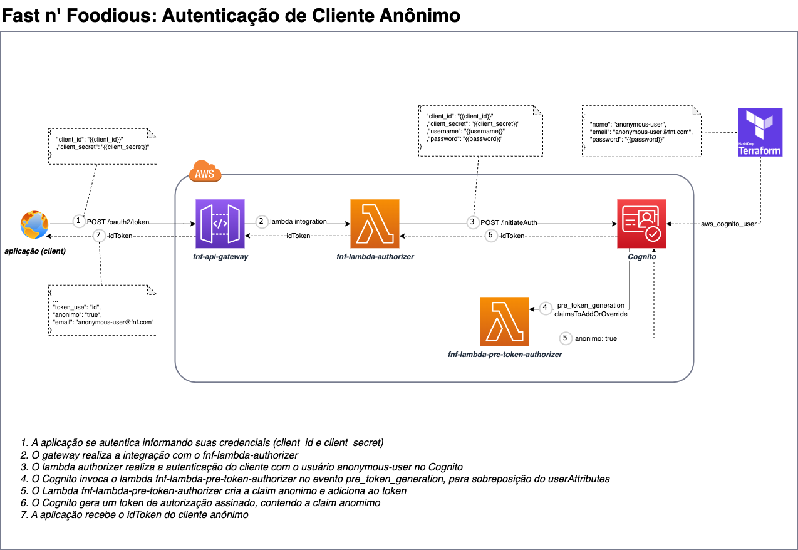

   

  

  

 

 


# 🍔 Fast & Foodious - Produto  

Sistema de auto-atendimento de fast food (microsserviço produto). Projeto de conclusão da Fase 04 da pós gradução em Software Architecture.
[TLDR; Execução em modo produção (on premisse deprecated)](#%EF%B8%8F-execução-em-modo-produção-deprecated-substituído-por-aws-fargate-ecs)

* [Arquitetura de Solução (Cloud AWS)](#arquitetura-de-solução-cloud-aws)
* [Arquitetura de Software](#arquitetura-de-software)
* [Instalação de Dependências Node](#-instalação-de-dependências-node)
* [Build da Aplicação](#-build-da-aplicação)
* [Executando a Aplicação](#%EF%B8%8F-executando-a-aplicação)
    * [Variáveis de Ambiente](#-variáveis-de-ambiente)
    * [Execução em modo local (in-memory repository)](#%EF%B8%8F-execução-em-modo-local-in-memory-repository)
    * [Execução em modo local (mysql repository)](#%EF%B8%8F-execução-em-modo-local-mysql-repository)
    * [**Execução em modo produção (on premisse deprecated)**](#%EF%B8%8F-execução-em-modo-produção-deprecated-substituído-por-aws-fargate-ecs)
        * [Docker Compose (Modo Fácil!)](#-docker-compose-modo-fácil)
        * [Docker (Modo Desbravador!)](#-docker-modo-desbravador)
        * [Kubernetes (Modo Fácil!)](#-kubernetes-modo-fácil)
        * [Kubernetes (Modo Desbravador!)](#-kubernetes-modo-desbravador)
* [Documentação da API (Swagger)](#-documentação-da-api-swagger)
* [Desinstalação & Cleanup](#-desinstalação--cleanup)
* [Testes](#-testes)
* [Estrutura Base do Projeto](#%EF%B8%8F-estrutura-base-do-projeto)
* [Cloud AWS](#cloud-aws)
    * [Cadastro de Clientes](#cadastro-de-clientes)
    * [Autenticação de Cliente Identificado](#autenticação-de-cliente-identificado)
    * [Autenticação de Cliente Anônimo](#autenticação-de-cliente-anônimo)
* [Banco de Dados](#banco-de-dados)
  * [Detalhes do Banco de Dados](#detalhes-do-banco-de-dados)
  * [Modelo de dados](#modelo-de-dados)
* [DDD](#ddd)
    * [Dicionário de Linguagem Ubíqua](/docs/dicionario-linguagem-ubiqua.md)
    * [Domain Storytelling](#domain-storytelling)
        * [Auto Cadastro de Clientes](#auto-cadastro-de-clientes)
        * [Realização de Pedidos](#realização-de-pedidos)
        * [Pagamento de Pedidos](#pagamento-de-pedidos)
        * [Preparo de Pedidos](#preparo-de-pedidos)
        * [Entrega de Pedidos](#entrega-de-pedidos)
        * [Fluxo de etapas dos Pedidos](#fluxo-de-etapas-dos-pedidos)
* [Links Externos](#links-externos)

## Arquitetura de Solução (Cloud AWS)




## Arquitetura de Software


- Cloud AWS
    - API Gateway, Lambda, Cognito, Fargate, ECS, Load Balancer, RDS, DocumentDB, etc
- Arquitetura Clean & Modular
    - Camada de Application, Enterprise, Presentation e Infrastructure
    - Módulo Main, Application, Presentation e Infrastructure
- Principais Tecnologias/Frameworks
    - Docker, Kubernetes, Helm, Kubectl, NodeJS, NestJS, TypeORM, NPM, Mysql, Swagger, Typescript, Jest
- Qualidade / Testes
    - Validações pré-commit/push
        - Validação de cobertura de testes
        - Testes unitários, e2e em memória (all green)
        - Validação de implementação de testes (modo alerta para implementação de testes de rest apis, services, usecases, validators, repositories)
    - CI/CD
        - Pipeline Github Actions para integração com a ```main```
            - fast-n-foodious-ci: unit-tests       - Execução de testes unitários (all green)
            - fast-n-foodious-ci: coverage-tests   - Execução de validação de cobertura de testes (all green)
            - fast-n-foodious-ci: check-test-impl  - Execução de validação de implementação de testes (mandatório para rest apis, services, usecases,  validators, repositories)
            - fast-n-foodious-ci: e2e-in-memory    - Execução de testes e2e em memória (all green)
            - fast-n-foodious-ci: e2e-mysql        - Execução de testes e2e com mysql (all green)
            - fast-n-foodious-ci: bdd-in-memory    - Execução de testes bdd com memória (all green)
            - fast-n-foodious-ci: bdd-in-mysql     - Execução de testes bdd com mysql (all green)
            - fast-n-foodious-ci: sonarcloud       - Execução de análise de código no SonarCloud
            - fast-n-foodious-ci: build            - Build de imagens docker (AMD & ARM) e publicação no DockerHub

***Nota:** Nas instruções abaixo, se assume que o diretório onde os comandos serão executados será a posta raiz do projeto ~/fast-n-foodious-ms-produto*

## 🚀 Instalação de Dependências Node
```bash
$ npm install
```

## 🧩 Build da Aplicação
```bash
$ npm run build
```

## ⚡️ Executando a Aplicação
O sistema pode ser executado com ou sem dependências externas.

### 📦 Variáveis de Ambiente
`NODE_ENV` como variável de ambiente, com os seguintes valores:
```
# env_name:
- local-mock-repository   # Variáveis usadas para rodar a aplicação em ambiente local, SEM dependência de container mysql
                          # Exemplo de caso de uso: debugar local rodando com o banco em memória
                          # $ NODE_ENV=local-mock-repository npm run start:debug

- local                   # Variáveis usadas para rodar a aplicação em ambiente local, COM dependência de container mysql
                          # Presume mysql rodando e a necessidade de atachar a aplicação ao container para desenvolver
                          # Exemplo de caso de uso: debugar local e apontando para o banco no container.
                          # $ MYSQL_HOST=localhost NODE_ENV=local npm run start:debug

- prod                    # Variáveis usadas para rodar a aplicação em ambiente de produção, COM dependøencia de container mysql
                          # $ NODE_ENV=prod npm run start:debug
```

```bash
# Desenvolvimento
$ NODE_ENV={env_name} npm run start

# Modo Watch
$ NODE_ENV={env_name} npm run start:dev

# Modo Debug
$ NODE_ENV={env_name} npm run start:debug

# Modo Produção
$ npm run start:prod
```
**Nota:** Se informado o env_name DIFERENTE de `local-mock-repository`, o modo de desenvolvimento, watch, debug e produção vai depender de ter um container mysql em execução.

### ⚡️ Execução em modo local (in-memory repository)
Utilizado **`apenas para desenvolvimento local, modo watch, debug, testes unitários e e2e`**. Executa a aplicação em modo local, com repositório em memória:
```bash
$ NODE_ENV=local-mock-repository npm run start
```

### ⚡️ Execução em modo local (mysql repository)
Utilizado **`apenas para desenvolvimento local, modo watch, debug, testes e2e `**. Inicia o contianer mysql com as variáveis locais e inicia a aplicação `(fora do container)`com as variáveis locais:
```bash
$ docker-compose --env-file ./envs/local.env -p "fast-n-foodious" up mysql
$ docker ps
CONTAINER ID   IMAGE       COMMAND                  CREATED         STATUS         PORTS                               NAMES
83c9b4d8880a   mysql:8.0   "docker-entrypoint.s…"   3 seconds ago   Up 2 seconds   0.0.0.0:3306->3306/tcp, 33060/tcp   mysql

# Executa a aplicação com as variáveis locais, conectando no container do mysql
$ MYSQL_HOST=localhost NODE_ENV=local npm run start
```

### 🚨⚡️ Execução em modo produção (deprecated: substituído por AWS Fargate ECS)
***Nota 1:** O K8S foi substituído pelo serviço gerenciado AWS Fargate ECS. A construção da insfraestrura é realizada através de IaC (Terraform) com seus respectivos scripts em repositórios específicos de Storage, Compute e Network. A documentação abaixo apenas ilustra a solução v2.0.0 (monolito) e foi mantida aqui caso seja necessário subir a aplicação de uma maneira mais fácil para avaliação dos instrutores.*

***Nota 2:** O container da aplicação depende do mysql estar up & running. Então seja paciente, o tempo para o container do mysql estar disponível pode veriar, dependendo da disponibilidade de recursos e suas configurações de hardware locais.* 

#### 🫧 Docker Compose (Modo Fácil!)
Inicia o container da aplicação e do mysql com as variáveis de produção, utilizando o docker compose:
```bash
$ docker-compose --env-file ./envs/prod.env build
$ docker-compose --env-file ./envs/prod.env up -d
$ docker ps
CONTAINER ID   IMAGE                        COMMAND                  CREATED         STATUS         PORTS                               NAMES
2a0f11e4ffe3   fast-n-foodious-ms-produto   "docker-entrypoint.s…"   5 seconds ago   Up 4 seconds   0.0.0.0:3000->3000/tcp              fast-n-foodious-ms-produto
06ebf6b90fa7   mysql:8.0                    "docker-entrypoint.s…"   5 seconds ago   Up 4 seconds   0.0.0.0:3306->3306/tcp, 33060/tcp   mysql
```

A opção acima, executa o container do micro serviço de forma isolada. Para rodar todos os micro serviços de forma conjunta, deve-se utilizar o `docker-compose-all.yml`. Este comando subirá todos os micro serviços e o banco de dados mysql. Esta forma de inicialização é recomendada para testes e as imagens é baixadas do github em sua versão latest:

```bash
$ docker-compose --env-file ./envs/local.env -f docker-compose-all.yml -p "fast-n-foodious" up
```

#### 💀 Docker (Modo Desbravador!)
Inicia o container da aplicação e do mysql com as variáveis de produção, utilizando *`imagens docker`* do mysql e da aplicação:
```bash
$ docker network create fast-n-foodious-network

$ docker run -d --rm --name mysql -p 3306:3306 \
    --env-file ./envs/prod.env --network fast-n-foodious-network \
    -v ./scripts/schema:/docker-entrypoint-initdb.d \
    -v mysql-data:/data/db \
    mysql:8.0

$ docker run -d --rm --name fast-n-foodious-ms-produto -p 3000:3000 \
    --env-file ./envs/prod.env --network fast-n-foodious-network \
    ottero/fast-n-foodious-ms-produto:latest

$ docker ps
CONTAINER ID   IMAGE                                        COMMAND                  CREATED         STATUS         PORTS                               NAMES
88bf7eae7e46   ottero/fast-n-foodious-ms-produto:latest     "docker-entrypoint.s…"   2 seconds ago   Up 1 second    0.0.0.0:3000->3000/tcp              fast-n-foodious-ms-produto
8b0268d435a6   mysql:8.0                                    "docker-entrypoint.s…"   6 seconds ago   Up 5 seconds   0.0.0.0:3306->3306/tcp, 33060/tcp   mysql
```

#### 🫧 Kubernetes (Modo Fácil!)
Inicia o pod da aplicação e do mysql com as variáveis de produção, assim como suas dependências (services, deployments, replicasets, hpas, configmaps, secrets, pv, pvc) utilizando o helm:
*Nota: Assume k8s pod/metrics-server up & running para habilitação de escalabilidade via HPA*

*Nota: O `PersistentVolume` está configurado para `Filesystem`, com o `hostpath` apontando para uma pasta local de usuário. Certifique de apontar para um local onde tenha permissão de escrita e leitura. Para alterar o valor dessa hostpath, altere o valor da propriedade `pv.hostPath` no arquivo `/helm/values.yaml`*

```bash
$ helm install fast-n-foodious-ms-produto helm/

NAME: fast-n-foodious-ms-produto
LAST DEPLOYED: Mon Aug 21 22:02:05 2023
NAMESPACE: default
STATUS: deployed
REVISION: 1
TEST SUITE: None

$ kubectl get all

NAME                                                READY   STATUS    RESTARTS        AGE
pod/fast-n-foodious-ms-produto-5c6cbcbf76-v4bgd     1/1     Running   1 (2m29s ago)   3m28s
pod/mysql-595c5c9d4f-x7grb                          1/1     Running   0               3m28s

NAME                                            TYPE              CLUSTER-IP      EXTERNAL-IP     PORT(S)        AGE
service/fast-n-foodious-ms-produto-svc          LoadBalancer      10.97.158.122   localhost       80:30000/TCP   3m28s
service/kubernetes                              ClusterIP         10.96.0.1       <none>          443/TCP        9d
service/mysql                                   ClusterIP         10.109.101.116  <none>          3306/TCP       3m28s

NAME                                            READY   UP-TO-DATE   AVAILABLE   AGE
deployment.apps/fast-n-foodious-ms-produto      1/1     1            1           3m28s
deployment.apps/mysql                           1/1     1            1           3m28s

NAME                                                    DESIRED   CURRENT   READY   AGE
replicaset.apps/fast-n-foodious-ms-produto-5c6cbcbf76   1         1         1       3m28s
replicaset.apps/mysql-595c5c9d4f                        1         1         1       3m28s

NAME                                                                    REFERENCE                               TARGETS             MINPODS   MAXPODS   REPLICAS   AGE
horizontalpodautoscaler.autoscaling/fast-n-foodious-ms-produto-hpa      Deployment/fast-n-foodious-ms-produto   46%/70%, 0%/70%     1         3         1          3m28s
```

#### 💀 Kubernetes (Modo Desbravador!)
Inicia o pod da aplicação e do mysql com as variáveis de produção, assim como suas dependências (services, deployments, replicasets, hpas, configmaps, secrets, pv, pvc) utilizando o CLI kubectl:
*Nota: Assume k8s pod/metrics-server up & running para habilitação de escalabilidade via HPA*

```bash
$ kubectl apply -f k8s/fast-n-foodious-ms-produto-secret.yml 
secret/fast-n-foodious-ms-produto-secret created

$ kubectl apply -f k8s/fast-n-foodious-ms-produto-configmap.yml 
configmap/fast-n-foodious-ms-produto-env created
configmap/mysql-env created

$ kubectl apply -f k8s/fast-n-foodious-pv.yml 
persistentvolume/fast-n-foodious-pv created

$ kubectl apply -f k8s/fast-n-foodious-pvc.yml 
persistentvolumeclaim/fast-n-foodious-pvc created

$ kubectl apply -f k8s/fast-n-foodious-ms-produto-deployment.yml 
deployment.apps/fast-n-foodious-ms-produto created
deployment.apps/mysql created

$ kubectl apply -f k8s/fast-n-foodious-ms-produto-service.yml 
service/fast-n-foodious-ms-produto-svc created
service/mysql created

$ kubectl apply -f k8s/fast-n-foodious-ms-produto-hpa.yml 
horizontalpodautoscaler.autoscaling/fast-n-foodious-hpa created

$ kubectl get all
NAME                                                READY   STATUS    RESTARTS   AGE
pod/fast-n-foodious-ms-produto-7fc6f95bdb-krcnm     1/1     Running   0          2m58s
pod/mysql-595c5c9d4f-5vpj8                          1/1     Running   0          2m58s

NAME                                            TYPE            CLUSTER-IP     EXTERNAL-IP   PORT(S)          AGE
service/fast-n-foodious-ms-produto-svc          LoadBalancer    10.110.74.44   localhost       80:30000/TCP     2m53s
service/kubernetes                              ClusterIP       10.96.0.1       <none>        443/TCP          5m52s
service/mysql                                   ClusterIP       10.108.3.249    <none>        3306/TCP         2m53s

NAME                                            READY   UP-TO-DATE   AVAILABLE   AGE
deployment.apps/fast-n-foodious-ms-produto      1/1     1            1           2m59s
deployment.apps/mysql                           1/1     1            1           2m59s

NAME                                                    DESIRED   CURRENT   READY   AGE
replicaset.apps/fast-n-foodious-ms-produto-7fc6f95bdb   1         1         1       2m59s
replicaset.apps/mysql-595c5c9d4f                        1         1         1       2m58s

NAME                                                                    REFERENCE                               TARGETS           MINPODS   MAXPODS   REPLICAS   AGE
horizontalpodautoscaler.autoscaling/fast-n-foodious-ms-produto-hpa      fast-n-foodious-ms-produto-n-foodious   69%/80%, 0%/80%   1         3         1          2m48s 
```

## 🧾 Documentação da API (Swagger)
`docker`    http://localhost:3000/api

`k8s`       http://localhost:80/api

## 🧼 Desinstalação & Cleanup
Para realizar a desistalação da aplicação e o cleanup da infraestrutura, basta realizar os comandos abaixos de acordo com o modo de instalação.
1. Se você utilizou o `docker` para subir a aplicação:

```bash
$ docker stop mysql fast-n-foodious-ms-produto
mysql
fast-n-foodious-ms-produto

$ docker volume rm mysql-data
mysql-data

$ docker network rm fast-n-foodious-network
fast-n-foodious-network

docker image rm ottero/fast-n-foodious-ms-produto
Untagged: ottero/fast-n-foodious-ms-produto:latest
Untagged: ottero/fast-n-foodious@sha256:58d0731f992f2755ee311a25603fde8c8c9ecd57e3f5aad34c32b41783284625
Deleted: sha256:e206061037e125c6b6b93bcc3b3ef61a59d8919753759d34527e38abe17c712e
Deleted: sha256:8cc3b430e851d9d31ff5049bb95e8032398a32203b7fbc49d1ac0ef65b4d1387
Deleted: sha256:a7fa60af5472f99af1f84d0f245d8e64f3897dcbd02f0c63f1817a09479a31cd
Deleted: sha256:3b012aad6f4a48c30a61d8834cebd0a48d3ef2e0680cd86545243618f782d778
Deleted: sha256:f93cb6531dabccc23848e273402d3fbef0515206efab1a29ccc1be81bf273dea
```

2. Se você utilizou o `docker compose` para subir a aplicação:
```bash
$ docker-compose --env-file ./envs/local.env -p "fast-n-foodious" down -v
[+] Running 4/4
 ✔ Container fast-n-foodious-ms-produto             Removed                                                                                           0.8s 
 ✔ Container mysql                                  Removed                                                                                           1.1s 
 ✔ Volume fast-n-foodious-ms-produto_mysql-data     Removed                                                                                           0.0s 
 ✔ Network fast-n-foodious_fast-n-foodious-network  Removed                                                                                           0.1s

$ docker image rm fast-n-foodious-ms-produto-fast-n-foodious
Untagged: fast-n-foodious-ms-produto-fast-n-foodious-ms-produto:latest
Deleted: sha256:357edf598a86260a5d755b8739b8be3ecd761ed51f8c9a84a5d32b93971e3e5e
```

Ou se você utilizou o docker compose com o `docker-compose-all.yml`:

```bash
$ docker-compose -f docker-compose-all.yml -p "fast-n-foodious" down -v
```

3. Se você utilizou o `helm` para subir a aplicação:
```bash
$ helm uninstall fast-n-foodious-ms-produto
release "fast-n-foodious-ms-produto" uninstalled
```

4. Se você utilizou o `kubeclt` para subir a aplicação:
```bash
$ kubectl delete -f k8s/fast-n-foodious-ms-produto-hpa.yml 
horizontalpodautoscaler.autoscaling "fast-n-foodious-ms-produto-hpa" deleted

$ kubectl delete -f k8s/fast-n-foodious-ms-produto-service.yml 
service "fast-n-foodious-ms-produto-svc" deleted
service "mysql" deleted

$ kubectl delete -f k8s/fast-n-foodious-ms-produto-deployment.yml 
deployment.apps "fast-n-foodious-ms-produto" deleted
deployment.apps "mysql" deleted

$ kubectl delete -f k8s/fast-n-foodious-pvc.yml 
persistentvolumeclaim "fast-n-foodious-pvc" deleted

$ kubectl delete -f k8s/fast-n-foodious-pv.yml 
persistentvolume "fast-n-foodious-pv" deleted

$ kubectl delete -f k8s/fast-n-foodious-ms-produto-configmap.yml 
configmap "fast-n-foodious-ms-produto-env" deleted
configmap "mysql-env" deleted

$ kubectl delete -f k8s/fast-n-foodious-ms-produto-secret.yml 
secret "fast-n-foodious-ms-produto-secret" deleted

$ docker image rm ottero/fast-n-foodious-ms-produto
Untagged: ottero/fast-n-foodious-ms-produto:latest
Untagged: ottero/fast-n-foodious-ms-produto@sha256:58d0731f992f2755ee311a25603fde8c8c9ecd57e3f5aad34c32b41783284625
Deleted: sha256:e206061037e125c6b6b93bcc3b3ef61a59d8919753759d34527e38abe17c712e
Deleted: sha256:8cc3b430e851d9d31ff5049bb95e8032398a32203b7fbc49d1ac0ef65b4d1387
Deleted: sha256:a7fa60af5472f99af1f84d0f245d8e64f3897dcbd02f0c63f1817a09479a31cd
Deleted: sha256:3b012aad6f4a48c30a61d8834cebd0a48d3ef2e0680cd86545243618f782d778
Deleted: sha256:f93cb6531dabccc23848e273402d3fbef0515206efab1a29ccc1be81bf273dea
```

5. Extra: se os testes de stress foram realizados no cluster kubernetes, via job k6:

```bash
$ kubectl delete -f k8s/fast-n-foodious-ms-produto-job.yml 
job.batch "k6-stress-job" deleted
configmap "k6-stress-env" deleted

$ docker image rm 24hoursmedia/k6-xarch
Untagged: 24hoursmedia/k6-xarch:latest
Untagged: 24hoursmedia/k6-xarch@sha256:62f55c01e327d15bef89275168cab9a7bb11c8450203bf15d052cfe2654d8a29
Deleted: sha256:0ea08d7adac52324b25f57d126491c6b7c2bf48ea0c714c893cdcebc1f2b8929
Deleted: sha256:4f90d3b645cdd7184811448c570951ee7c3c032770c1956f25e8fcdfd4d79e9b
Deleted: sha256:6f16c4dda6e7ae2562218ba06bae1285ff33934b991620db4f591ac60d35ee5c
Deleted: sha256:0f7b3ff8b310adb0c38fa8108967e51e3431bc4b7ce350de93839eeffcefd34c
```

*Nota: Certifique-se de remover a pasta do `PersistentVolume` que está configurado para `Filesystem`. O local da pasta está definido no valor da propriedade `pv.hostPath` no arquivo `/helm/values.yaml`*

## 🎮 Extras Docker Compose

```bash
# Build com docker-compose utilizando env específica
$ docker-compose --env-file ./envs/{env-name}.env build

# Execução dos serviços registrados no docker-compose utilizando env específica
$ docker-compose --env-file ./envs/{env-name}.env -p "fast-n-foodious" up

# Execução de um serviço registrados no docker-compose utilizando env específica
$ docker-compose --env-file ./envs/{env-name}.env -p "fast-n-foodious" up {service}

# Interrupção dos serviços registrados no docker-compose utilizando env específica
$ docker-compose --env-file ./envs/{env-name}.env -p "fast-n-foodious" down -v

# Interrupção de um serviço registrados no docker-compose utilizando env específica
$ docker-compose --env-file ./envs/{env-name}.env -p "fast-n-foodious" down {service} -v
```
**Nota:** Os serviços registrados no docker-compose são:
```
- fast-n-foodious-ms-produto
- mysql
```

## 🧪 Testes
O projeto cobre testes unitários, bdd, testes e2e e testes isolados de api (para desenvolvedor), além de verifiar a cobertura dos testes:
```bash
# Execução de testes unitários
$ npm run test

# Execução de cobertura de testes
$ npm run test:cov

# Execução de testes e2e SEM dependência de banco de dados (in-memory repository)
$ NODE_ENV=local-mock-repository npm run test:e2e

# Execução de testes e2e COM dependência de banco de dados (mysql repository)
# 1. Necessita do container mysql em execução!
# 2. Considere remover o volume criado no mysql caso execute o teste mais de uma vez!
$ NODE_ENV=local npm run test:e2e

# Execução de testes bdd SEM dependência de banco de dados (in-memory repository), considerar os comandos em terminais distintos
$ NODE_ENV=local-mock-repository npm run start && npx wait-on http://localhost:3000
$ npm run test:bdd

# Execução de testes bdd COM dependência de banco de dados (mysql repository)
# 1. Necessita do container mysql em execução!
# 2. Considere remover o volume criado no mysql caso execute o teste mais de uma vez!
$ MYSQL_HOST=localhost NODE_ENV=local npm run start && npx wait-on http://localhost:3000
$ NODE_ENV=local npm run test:bdd
```

### 🧪 Testes Stress 
Excução de testes de stress cluster k8s, utilizando job k6.
*Nota: A execução tem duração de 60s, estressando o path /health. Assume a aplicação e mysql up & running no cluster kubernetes*

```bash
$ kubectl apply -f k8s/fast-n-foodious-ms-produto-job.yml 
job.batch/k6-stress-job created
configmap/k6-stress-env created

$ kubectl get po
NAME                                            READY   STATUS    RESTARTS        AGE
fast-n-foodious-ms-produto-5c6cbcbf76-n5vn5     1/1     Running   1 (6m49s ago)   7m46s
fast-n-foodious-ms-produto-5c6cbcbf76-q5q7t     1/1     Running   0               106s
k6-stress-job-fkjv9                             1/1     Running   0               6s
mysql-595c5c9d4f-chlrx                          1/1     Running   0               7m46s

$ kubectl logs -f k6-stress-job-fkjv9

          /\      |‾‾| /‾‾/   /‾‾/   
     /\  /  \     |  |/  /   /  /    
    /  \/    \    |     (   /   ‾‾\  
   /          \   |  |\  \ |  (‾)  | 
  / __________ \  |__| \__\ \_____/ .io

  execution: local
```

# 🏛️ Estrutura Base do Projeto
```
.github/                                # Configurações de pipelines CI/CD
docs/                                   # Documentação da aplicação
envs/                                   # Configurações de ambiente
helm/                                   # Configuração de descriptors Helm
k8s/                                    # Configuração de descriptors kubernetes
scripts/                                # Scripts gerais de inicialização e validação (git prepush, precommit - cobertura de testes, testes unitários, e2e MySQL e memória)
src/                                    # Source da solução
├── application                         # Camada de Application (use cases, validators)    
│   ├── categoria
│   │   └── providers                   # Registro de providers (services, usecases, validators). utilizados via DI
│   │   └── service                     # Serviços (controllers) de composição de casos de uso
│   │   └── usecase                     # Casos de usos
│   │   └── validation                  # Validators (regras de negócio)
│   └── produto
├── enterprise                          # Camada Enterprise (domínio)
│   ├── categoria
│   │   ├── model                       # Entidades de domínio
│   ├── exception                       # Exceções de domínio
│   ├── produto
│   ├── repository                      # Portas de repositórios da camana de domínio
│   ├── service                         # Portas de serviços da camana de domínio
│   └── validation                      # Contrato de validações da camada de domínio
├── infrastructure                      # Camada Infrastructure (banco de dados, ORM)
│   ├── exception                       # Exceções de infraestrutura
│   └── persistence
│       ├── categoria
│       │   ├── entity                  # Entitdades ORM
│       │   └── repository              # Repositórios (mysql, in-memory)
│       ├── mysql                       # Configurações de banco de dados MySQL 
│       ├── produto
│       ├── providers                   # Registro de providers (repositorório in-memory, typeorm). utilizados via DI
├── presentation                        # Camada Presentation (rest api)
│   └── rest
│   │   ├── categoria
│   │   │   ├── api                     # Rest API
│   │   │   ├── request                 # Contratos de entrada
│   │   │   └── response                # Contratos de saída
│   │   ├── handler                     # Handlers para tratamento centralizado de exceções (ValidationException, DomainException)
│   │   ├── produto
│   │   ├── response                    # Contrato de resposta de erro http padrão
│   └── swagger                         # Configurações (constantes) Swagger
└── shared                              # Itens compartilhados
test/                                   # Implementações de testes
├── api                                 # Testes de API (utilitário de desenvolvimento)
├── e2e                                 # Testes E2E
└── stress                              # Testes de stress (k6 e/ou cluster k8s)
```

## Cloud AWS
### Cadastro de Clientes


### Autenticação de Cliente Identificado


### Autenticação de Cliente Anônimo


## Banco de Dados
### Detalhes do Banco de Dados
[Detalhes do Banco de Dados](/docs/banco-de-dados.md)

### Modelo de Dados


## DDD
### Domain Storytelling
#### Auto Cadastro de Clientes 


#### Realização de Pedidos


#### Pagamento de Pedidos


#### Preparo de Pedidos


#### Entrega de Pedidos


#### Fluxo de Etapas dos Pedidos


## Links Externos
### Micro Serviços
- [fast-n-foodious-ms-produto](https://github.com/rodrigo-ottero/fast-n-foodious-ms-produto)
- [fast-n-foodious-ms-pagamento](https://github.com/rodrigo-ottero/fast-n-foodious-ms-pagamento)
- [fast-n-foodious-ms-pedido](https://github.com/rodrigo-ottero/fast-n-foodious-ms-pedido)

### IaC
- [fast-n-foodious-iac-network](https://github.com/rodrigo-ottero/fast-n-foodious-iac-network)
- [fast-n-foodious-iac-storage](https://github.com/rodrigo-ottero/fast-n-foodious-iac-storage)
- [fast-n-foodious-iac-compute](https://github.com/rodrigo-ottero/fast-n-foodious-iac-compute)

### Sonar
- [fast-n-foodious-ms-produto](https://sonarcloud.io/summary/overall?id=fast-n-foodious-org_ms-produto)
- [fast-n-foodious-ms-pagamento](https://sonarcloud.io/summary/overall?id=fast-n-foodious-org_fast-n-foodious-ms-pagamento)
- [fast-n-foodious-ms-pedido](https://sonarcloud.io/summary/overall?id=fast-n-foodious-org_fast-n-foodious-ms-pedido)

### Monday
- [fast-n-foodious](https://fast-n-foodious.monday.com/workspaces/4361241)